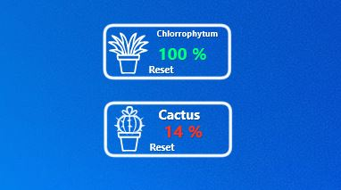

<h1 align="center">
  PlantRainmeter - <a href="https://www.rainmeter.net/">Rainmeter</a> skin
   
</h1>

  

 

PlantRainmeter is a [Rainmeter](https://www.rainmeter.net/) skin to help you keep an eye on ground humidity levels, right from your desktop using data from a simple moisture(humidity) sensor and an Arduino board

  
### Features 
- Gets data directly from your sensors 
- Click icon to customize your plant name and logo
- Last check time info displayed on hover. 
- Change any text or icon color. 
- 8 variants  
 

### What you'll need
- An Arduino board 
- Humidity sensor YL-69(or HL-69 , not tested but should work fine) 
- Jumper wires

### Installation Instructions  
- Connect your hardware following the circuit schematic drawing of the sensor YL-69 and the Arduino, if you need help : <a href="https://randomnerdtutorials.com/guide-for-soil-moisture-sensor-yl-69-or-hl-69-with-the-arduino/">Random Nerd Tutorial</a>
- Connect Analog pin A2 of Arduino to the analog output AO of the plant sensor
- GND of Arduino and sensor should be connected together
- Connect VCC of sensor to Arduino +5V
- Don't forget to change your output folder from the Arduino to the Rainmeter-Plant skin folder
- Enable the skin from Rainmeter, change name and icon as per your plant specifics
- Done ! Wasn't so hard , was it ?
  
## Contact me if you need help setting it up 
